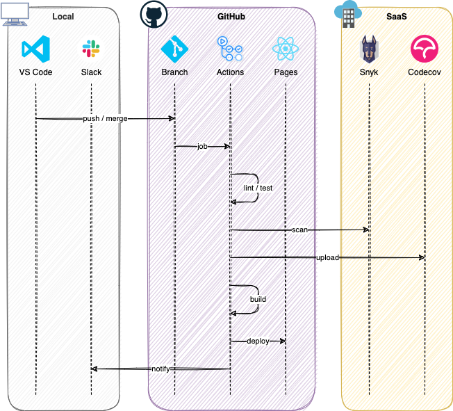

# @kawasawa

## 概要

制作物や執筆記事を一覧表示するための Web サイトです。

<https://kawasawa.github.io>

## 技術情報

フロントエンドのみの実装で、[React](https://ja.reactjs.org) を基盤とし [MUI (Material UI)](https://mui.com) でインターフェイスを構築しています。  
システムの展開と運用は GitHub で行っており、バックエンドに相当する処理は Google 内のサービスで代用しています。

|                              | 技術スタック         |
| ---------------------------- | -------------------- |
| 開発言語                     | TypeScript           |
| フロントエンドフレームワーク | React                |
| CSS フレームワーク           | MUI (Material UI)    |
| テストフレームワーク         | Jest                 |
| フォーマッター               | Prettier             |
| リンター                     | ESLint               |
| パッケージマネージャー       | Yarn                 |
| CI/CD                        | GitHub Actions       |
| 脆弱性スキャン               | Snyk                 |
| カバレッジ可視化             | Codecov              |
| ホスティング                 | GitHub Pages         |
| バッチ処理                   | Google Apps Script   |
| データ永続化                 | Google Spread Sheets |
| メール送信                   | EmailJS, SendGrid    |

### Overview

Web サイトは GitHub Pages によってホスティングされています。  
ページ内に表示される Qiita の記事は、Apps Script により自動取得されたものです。これらの情報は Spread Sheets に記録されており、簡易的な DB としての役割を担います。  
また、問い合わせフォームによるメールの送信処理は、EmailJS によりフロントエンドから直接実行され SendGrid を利用し送信されます。

### Workflow

CI/CD は GitHub Actions によって実行されています。
master ブランチへの push / merge をトリガーに CI/CD パイプラインが開始されます。はじめに静的解析、テスト、Snyk による脆弱性スキャンを行います。これらの検証をパスすれば、カバレッジレポートを Codecov にアップロードし、アプリをビルドして GitHub Pages へデプロイします。パイプラインのステータスは、連携された Slack から確認できます。

以上
