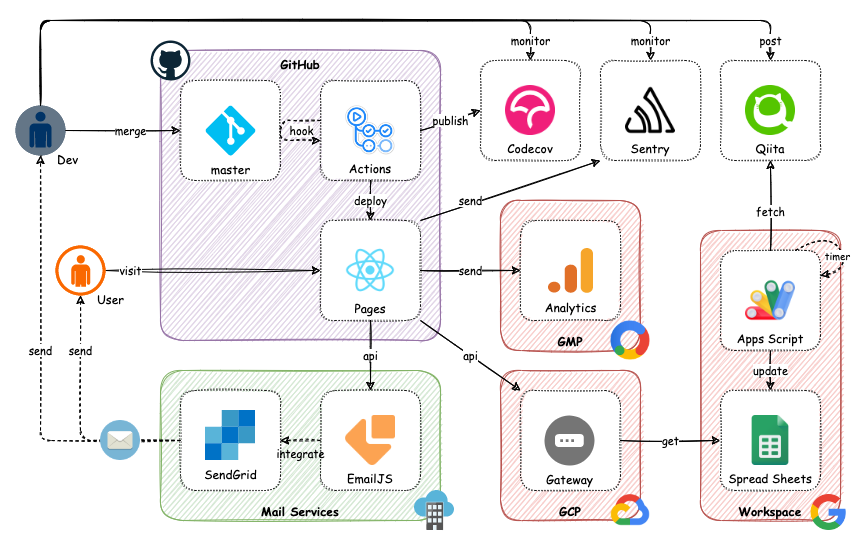
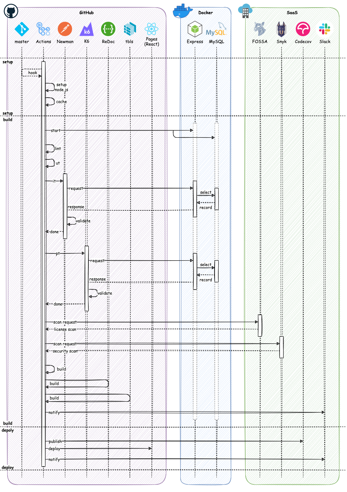
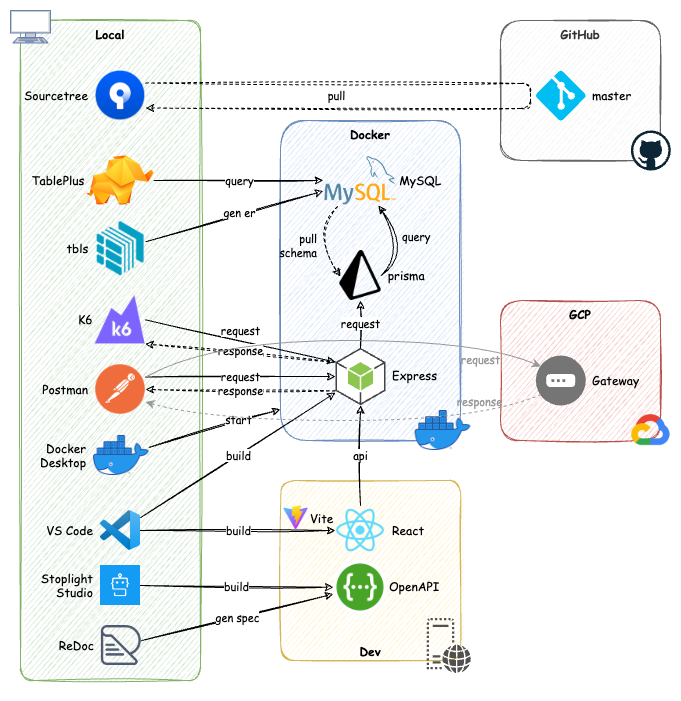

# @kawasawa

## 概要

筆者の制作物、執筆記事、業務経歴をまとめた Web サイトです。

- <https://kawasawa.github.io>

## 技術情報

実装はフロントエンドのみで、React を基盤とし MUI でインターフェイスを構築しています。  
システムの展開と運用は GitHub で行っており、バックエンドに相当する処理は Google 内のサービスで代用しています。

[](https://stackshare.io/kawasawa/kawasawa-github-io)

| 技術スタック              |                                                                                                                        |
| ------------------------- | ---------------------------------------------------------------------------------------------------------------------- |
| 開発言語                  | [TypeScript](https://www.typescriptlang.org/)                                                                          |
| JavaScript フレームワーク | [React](https://ja.reactjs.org/)                                                                                       |
| CSS フレームワーク        | [MUI (Material UI)](https://mui.com/)                                                                                  |
| テストフレームワーク      | [Jest](https://jestjs.io/)                                                                                             |
| HTTP クライアント         | [Axios](https://axios-http.com/)                                                                                       |
| OR マッパー               | [Prisma](https://www.prisma.io/)                                                                                       |
| リンター                  | [ESLint](https://eslint.org/) , [Secretlint](https://github.com/secretlint/secretlint/)                                |
| フォーマッター            | [Prettier](https://prettier.io/)                                                                                       |
| パッケージマネージャー    | [Yarn](https://yarnpkg.com/)                                                                                           |
| ビルドツール              | [Vite](https://vitejs.dev/)                                                                                            |
| ER 図生成ツール           | [tbls](https://github.com/k1LoW/tbls/)                                                                                 |
| API 仕様書生成ツール      | [ReDoc](https://redocly.com/redoc/)                                                                                    |
| API テストツール          | [Newman](https://learning.postman.com/docs/running-collections/using-newman-cli/command-line-integration-with-newman/) |
| 性能テストツール          | [K6](https://k6.io/)                                                                                                   |
| CI/CD                     | [GitHub Actions](https://github.co.jp/features/actions)                                                                |
| ホスティング              | [GitHub Pages](https://docs.github.com/ja/pages/getting-started-with-github-pages/about-github-pages)                  |
| ライセンススキャン        | [FOSSA](https://fossa.com/)                                                                                            |
| 脆弱性スキャン            | [Snyk](https://snyk.io/)                                                                                               |
| カバレッジ計測            | [Codecov](https://about.codecov.io/)                                                                                   |
| エラー解析                | [Sentry](https://sentry.io/)                                                                                           |
| アクセス解析              | [Google Analytics](https://analytics.google.com/analytics/web/)                                                        |
| バッチ処理                | [Google Apps Script](https://workspace.google.co.jp/intl/ja/products/apps-script/)                                     |
| データ永続化              | [Google Spread Sheets](https://www.google.com/intl/ja_jp/sheets/about/)                                                |
| メール配信                | [EmailJS](https://www.emailjs.com/) , [SendGrid](https://sendgrid.com/)                                                |

### アーキテクチャ

Web サイトは GitHub Pages によってホスティングされています。  
アクセス情報は Google Analytics で、エラー情報は Sentry で解析されます。  
ページ内に表示される Qiita の記事は、Apps Script により自動取得されたものです。日次で収集されるこれらの情報は、DB の代替として永続化を担う Spread Sheets に蓄積されており、クライアントは Google Sheets API を介してレコードを抽出します。  
また、問い合わせの送信はメールによって通知される方式で、この処理は EmailJS を介してフロントエンドから直接実行され SendGrid によりメール配信が行われます。



### ワークフロー

CI/CD は GitHub Actions によって実現されており、パイプラインは master ブランチへの merge をトリガーにスタートします。  
静的解析 (ESLint)、UT (Jest)、IT (Newman)、性能テスト (K6)、ライセンススキャン (FOSSA)、脆弱性スキャン (Snyk) を順次行い、これらの検証をパスすればアプリをビルドします。  
ビルドされたアプリは、ER 図 (tbls), API 仕様書 (ReDoc)、検証レポート類 (Codecov, Newman Reporter, K6 Reporter) と併せてデプロイされ、Web サイトが GitHub Pages にリリースされます。  
連携された Slack からは、パイプラインのステータスを確認できます。



## 開発情報

### 開発環境

開発環境で React アプリケーションを動かす際は、GCP への疎通は行わず、API 処理をモックで代用します。モックは Express と MySQL を組み合わせた API サーバが Docker 上に展開されたもので、アプリケーションはこのサーバに対して疎通を試みます。



現在は macOS で開発しておりますが、もともとは Windows 上で環境構築していたため、使用したツール類は macOS / Windows 対応のクロスプラットフォームアプリを中心に選定しています。VS Code でのコーディングとテストのほか、Sourcetree でのバージョン管理、Docker での環境構築、Chrome での動作確認からなります。ローカルで実行されるモックサーバに対する API テストやパフォーマンス測定に意義はありませんが、実際の開発現場に近い環境を用意したく必要なツール類を導入しています。  
なお、使用する Node.js のバージョンは [.tool-versions](./.tool-versions) をご確認ください。

| 製品                |                                                                   |
| ------------------- | ----------------------------------------------------------------- |
| OS                  | [macOS](https://www.apple.com/jp/macos/)                          |
| パッケージ管理      | [Homebrew](https://brew.sh/)                                      |
| ランタイム管理      | [asdf](https://asdf-vm.com/)                                      |
| Web ブラウザ        | [Google Chrome](https://www.google.com/chrome/)                   |
| Docker コンテナ管理 | [Docker Desktop](https://www.docker.com/products/docker-desktop/) |
| コードエディタ      | [Visual Studio Code](https://code.visualstudio.com/)              |
| OpenAPI エディタ    | [Stoplight Studio](https://stoplight.io/)                         |
| Git クライアント    | [Sourcetree](https://www.sourcetreeapp.com/)                      |
| DB クライアント     | [TablePlus](https://tableplus.com/)                               |
| API クライアント    | [Postman](https://www.postman.com/)                               |
| 性能テストツール    | [K6](https://k6.io/)                                              |
| 作図ツール          | [draw.io](https://app.diagrams.net/)                              |

### ディレクトリ構成

プロダクトのディレクトリ構成を下記に示します。  
app 配下がフロントエンド (React ソースファイル) 、mock 配下がバックエンドのモック (Express ソースファイルおよび MySQL 構成ファイル) となっています。

```:
+--.github             // GitHub関連ファイル
|
+--.vscode             // VSCode設定ファイル
|
+--.workspace          // その他雑多なファイル
|
+--app                 // Reactアプリケーション
|  |
|  +--public           // 公開ファイル
|  |
|  +--src              // ソースファイル
|  |  |
|  |  +--api           // APIクライアント
|  |  |
|  |  +--assets        // 静的ファイル
|  |  |
|  |  +--components    // ページに配置される部品
|  |  |  |
|  |  |  +--controls   // 部品を構成するコントロール
|  |  |  |
|  |  |  +--dialogs    // 部品に内包されるダイアログ
|  |  |
|  |  +--entities      // オブジェクト
|  |  |
|  |  +--hooks         // カスタムフック
|  |  |
|  |  +--locales       // 多言語情報
|  |  |
|  |  +--pages         // ページ定義
|  |  |
|  |  +--utils         // 汎用処理
|  |
|
+--mock                // モック
|  |
|  +--docker           // Docker関連ファイル
|  |  |
|  |  +--mysql         // MySQL設定ファイル
|  |
|  +--server           // Expressアプリケーション
|  |  |
|  |  +--prisma        // Prismaスキーマ定義
|  |  |
|  |  +--src           // ソースファイル
|  |  |  |
|  |  |  +--api        // API処理
|  |  |  |
|  |  |  +--routes     // ルーティング処理
|  |  |
|  |
|
+--tools               // ツール類
|  |
|  +--gas              // GASソースファイル
|  |
|  +--k6               // 負荷試験用テストコード
|  |
|  +--postman          // APIテストコード
|  |
|  +--swagger          // OpenAPI定義書生成仕様
|  |
|  +--tbls             // DB定義書生成仕様
|
```

### あえてやっていないこと

- ブランチ戦略  
  本来であれば、ブランチを main, develop, feature などに分け、レビューを経て製品版にマージするのが常套ですが、本開発ではこれを実施しません。  
  大きな要因としては、比較的頻繁に変更が入る上、実験的な内容も多く、コミット履歴が荒れることを嫌ったためです。また、ポートフォリオサイトという特性上、開発者が筆者一人に限られるためレビューに有効性がありません。

- 本番環境分離  
  通常、Web サイトのリリースでは、資材をステージング環境に展開しテストを経てから本番環境に適用します。  
  本開発では、アプリケーションを更新する際、即座に本番環境の資材が置き換えられます。CI/CD パイプラインで静的解析、テスト、スキャンが済んでおり、仮にリリースミスやデグレードが発生した場合も影響範囲は限られ、容易に切り戻し可能なためです。

### ドキュメント

プロダクトの品質評価に関わる資料を下記に列挙します。

- [ライセンススキャン結果 (FOSSA)](https://app.fossa.com/projects/custom%2B34428%2Fgithub.com%2Fkawasawa%2Fkawasawa.github.io)
- [脆弱性スキャン結果 (Snyk)](https://snyk.io/test/github/kawasawa/kawasawa.github.io)
- [カバレッジレポート (Codecov)](https://app.codecov.io/gh/kawasawa/kawasawa.github.io?search=&displayType=list)
- [結合試験レポート (Newman)](https://kawasawa.github.io/docs/ita)
- [性能試験レポート (K6)](https://kawasawa.github.io/docs/pt)

開発者向けの資料を下記に列挙します。

- [開発手引き](https://github.com/kawasawa/kawasawa.github.io/blob/master/NOTE.md)
- [ER 図 (tbls)](https://kawasawa.github.io/docs/er/)
- [API 仕様書 (ReDoc)](https://kawasawa.github.io/docs/api)
- [ライセンス情報 (Yarn)](https://kawasawa.github.io/docs/licenses.txt)

以上
