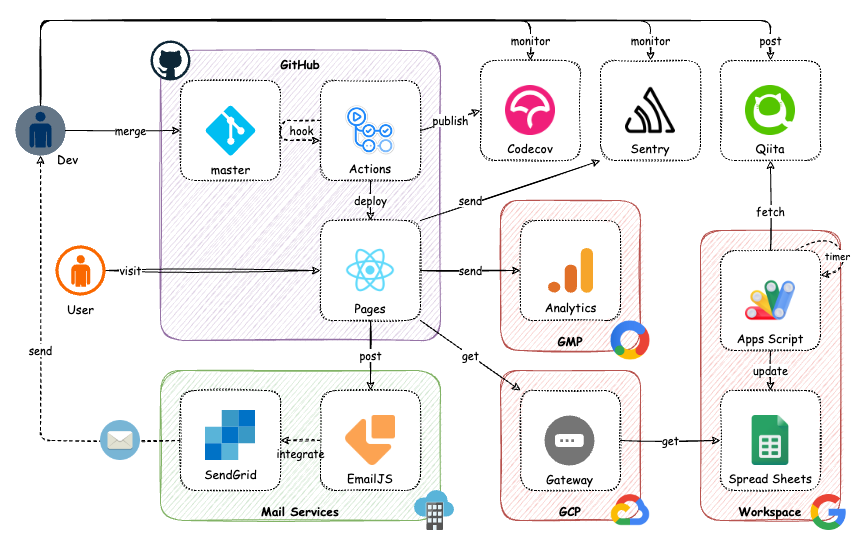

# @kawasawa

筆者の制作物、執筆記事、業務経歴をまとめた Web サイトです。

- <https://kawasawa.github.io>

## 技術情報

本番運用はフロントエンドのみで、React.js を基盤とし MUI でインターフェイスを構築しています。  
システムの展開と運用は GitHub で行っており、バックエンドに相当する処理は Google 内のサービスで代用しています。

> [!NOTE]
> 開発環境用のモック (バックエンド) については [README.md](https://github.com/kawasawa/kawasawa.github.io/blob/master/mock/server/README.md) をご参照ください。

### 技術スタック

| 種別                      | 使用技術                                                                                                               |
| ------------------------- | ---------------------------------------------------------------------------------------------------------------------- |
| 開発言語                  | [TypeScript](https://www.typescriptlang.org/)                                                                          |
| JavaScript フレームワーク | [React.js](https://ja.reactjs.org/)                                                                                    |
| CSS フレームワーク        | [MUI (Material UI)](https://mui.com/)                                                                                  |
| テストフレームワーク      | [Jest](https://jestjs.io/)                                                                                             |
| 多言語対応                | [i18next](https://www.i18next.com/)                                                                                    |
| HTTP クライアント         | [Axios](https://axios-http.com/)                                                                                       |
| バリデーター              | [Yup](https://github.com/jquense/yup/)                                                                                 |
| リンター                  | [ESLint](https://eslint.org/) , [Secretlint](https://github.com/secretlint/secretlint/)                                |
| フォーマッター            | [Prettier](https://prettier.io/)                                                                                       |
| パッケージマネージャー    | [Yarn](https://yarnpkg.com/)                                                                                           |
| ビルドツール              | [Create React App](https://create-react-app.dev/) , [CRACO](https://craco.js.org/)                                     |
| ER 図生成ツール           | [tbls](https://github.com/k1LoW/tbls/)                                                                                 |
| API 仕様書生成ツール      | [ReDoc](https://redocly.com/redoc/)                                                                                    |
| API テストツール          | [Newman](https://learning.postman.com/docs/running-collections/using-newman-cli/command-line-integration-with-newman/) |
| 性能テストツール          | [K6](https://k6.io/)                                                                                                   |
| CI/CD                     | [GitHub Actions](https://github.co.jp/features/actions/)                                                               |
| ホスティング              | [GitHub Pages](https://docs.github.com/ja/pages/getting-started-with-github-pages/about-github-pages/)                 |
| ライセンススキャン        | [FOSSA](https://fossa.com/)                                                                                            |
| 脆弱性スキャン            | [Snyk](https://snyk.io/)                                                                                               |
| カバレッジ計測            | [Codecov](https://about.codecov.io/)                                                                                   |
| エラー解析                | [Sentry](https://sentry.io/)                                                                                           |
| アクセス解析              | [Google Analytics](https://analytics.google.com/analytics/web/)                                                        |
| バッチ処理                | [Google Apps Script](https://workspace.google.co.jp/intl/ja/products/apps-script/)                                     |
| データ永続化              | [Google Spread Sheets](https://www.google.com/intl/ja_jp/sheets/about/)                                                |
| メール配信                | [EmailJS](https://www.emailjs.com/) , [SendGrid](https://sendgrid.com/)                                                |

### アーキテクチャ

Web サイトは GitHub Pages によってホスティングされています。  
アクセス情報は Google Analytics で、エラー情報は Sentry で解析されます。  
ページ内に表示される Qiita の記事は、Apps Script により自動取得されたものです。日次で収集されるこれらの情報は、DB の代替として永続化を担う Spread Sheets に蓄積されており、クライアントは Google Sheets API を介してレコードを抽出します。  
また、問い合わせの送信はメールによって通知される方式で、この処理は EmailJS を介してフロントエンドから直接実行され SendGrid によりメール配信が行われます。



### ワークフロー

CI/CD は GitHub Actions によって実現されており、パイプラインは master ブランチへの merge をトリガーにスタートします。  
静的解析 (ESLint)、UT (Jest)、IT (Newman)、性能テスト (K6)、ライセンススキャン (FOSSA)、脆弱性スキャン (Snyk) を順次行い、これらの検証をパスすればアプリをビルドします。  
ビルドされたアプリは、ER 図 (tbls), API 仕様書 (ReDoc)、検証レポート類 (Codecov, Newman Reporter, K6 Reporter) と併せてデプロイされ、Web サイトが GitHub Pages にリリースされます。  
連携された Slack からは、パイプラインのステータスを確認できます。


### セキュリティ

> [!WARNING]
> バックエンドはモックであるため本番運用には使用しません。運用を想定したコードの作成のみになります。

サーバでは CORS ポリシーや CSRF トークンによる検証が行われており、下記に処理の流れを示す。


## 開発情報

### 開発環境

開発環境でアプリケーションを動かす際は、GCP への疎通は行わず、API 処理をモックで代用します。モックは Express.js と MySQL を組み合わせた API サーバが Docker 上に展開されたもので、アプリケーションはこのサーバに対して疎通を試みます。


VS Code でのコーディングとテストのほか、Sourcetree でのバージョン管理、Docker での環境構築、Chrome での動作確認からなります。API サーバはローカルで実行するためのモックであり、これに対するテストやパフォーマンス測定に意義はありませんが、実際の開発現場に近い環境を用意したく必要なツール類を選定しています。  
具体的なアプリは [Brewfile](./Brewfile) を、ランタイムバージョンは [.tool-versions](./.tool-versions) をご参照ください。

| 種別                | 使用ツール                                                        |
| ------------------- | ----------------------------------------------------------------- |
| OS                  | [macOS](https://www.apple.com/jp/macos/)                          |
| パッケージ管理      | [Homebrew](https://brew.sh/)                                      |
| ランタイム管理      | [asdf](https://asdf-vm.com/)                                      |
| JS パッケージ管理   | [Yarn](https://yarnpkg.com/)                                      |
| Web ブラウザ        | [Google Chrome](https://www.google.com/chrome/)                   |
| Docker コンテナ管理 | [Docker Desktop](https://www.docker.com/products/docker-desktop/) |
| コードエディタ      | [Visual Studio Code](https://code.visualstudio.com/)              |
| OpenAPI エディタ    | [Stoplight Studio](https://stoplight.io/)                         |
| Git クライアント    | [Sourcetree](https://www.sourcetreeapp.com/)                      |
| DB クライアント     | [TablePlus](https://tableplus.com/)                               |
| API クライアント    | [Postman](https://www.postman.com/)                               |
| 性能テストツール    | [K6](https://k6.io/)                                              |
| 作図ツール          | [draw.io](https://app.diagrams.net/)                              |

### ディレクトリ構成

プロダクトのディレクトリ構成を下記に示します。  
app 配下がフロントエンド (React.js) 、mock 配下がバックエンドのモック (Express.js および MySQL) になります。

```:
+--.github/                    # GitHub 関連ファイル
|  |
|  +--workflows/               # GitHub Actions ワークフロー
|
|
+--.vscode/                    # VSCode 設定ファイル
|
|
+--app/                        # React.js アプリケーション
|  |
|  +--public/                  # 公開ファイル
|  |
|  +--src/                     # ソースファイル
|  |  |
|  |  +--@types/               # 型定義ファイル
|  |  |
|  |  +--assets/               # 静的ファイル
|  |  |
|  |  +--components/           # ページで使用するコンポーネント
|  |  |  |
|  |  |  +--dialogs/           # ページに内包されるダイアログ
|  |  |  |
|  |  |  +--elements/          # ページに配置する部品
|  |  |  |
|  |  |  +--layouts/           # ページを構成するレイアウト
|  |  |
|  |  +--constants/            # 定数グループ
|  |  |
|  |  +--entities/             # オブジェクト
|  |  |
|  |  +--hooks/                # カスタムフック
|  |  |
|  |  +--lib/                  # ライブラリラッパー
|  |  |
|  |  +--locales/              # 多言語情報
|  |  |
|  |  +--pages/                # ページ定義
|  |  |
|  |  +--schemas/              # バリデーション定義
|  |  |
|  |  +--utils/                # 汎用処理
|
|
+--docs/                       # ドキュメント類
|  |
|  +--images/                  # 画像ファイル
|
|
+--mock/                       # モック
|  |
|  +--docker/                  # Docker 関連ファイル
|  |  |
|  |  +--mysql/                # MySQL 設定ファイル
|  |  |
|  |  +--sonarqube/            # SonarQube 関連ファイル
|  |
|  +--server/                  # Express.js アプリケーション
|  |  |
|  |  +--src/                  # ソースファイル
|  |  |  |
|  |  |  +--@types/            # 型定義ファイル
|  |  |  |
|  |  |  +--api/               # API 処理
|  |  |  |
|  |  |  +--db/                # DB 処理
|  |  |  |
|  |  |  +--middlewares/       # ミドルウェア
|  |  |  |
|  |  |  +--responses/         # レスポンス型定義
|  |  |  |
|  |  |  +--routes/            # ルーティング
|  |  |  |
|  |  |  +--schemas/           # バリデーション定義
|  |
|  +--docker-compose.yml       # モックサーバ用 Docker Compose 設定ファイル
|  |
|  +--Makefile                 # モックサーバ用コマンド
|
|
+--tools/                      # ツール類
|  |
|  +--gas/                     # GAS ソースファイル
|  |
|  +--k6/                      # 負荷試験用テストコード
|  |
|  +--postman/                 # API テストコード
|  |
|  +--swagger/                 # OpenAPI 定義書生成仕様
|  |
|  +--tbls/                    # DB 定義書生成仕様
|
```

### コマンド

下記は開発時に使用する主要な Yarn コマンドの一覧です。

|                              | コマンド              | 概要                                                                                                                                                        |
| ---------------------------- | --------------------- | ----------------------------------------------------------------------------------------------------------------------------------------------------------- |
| パッケージのインストール     | `yarn install`        | 依存パッケージをインストールする                                                                                                                            |
| サービスのローカル起動       | `yarn start`          | サービスをローカル環境で起動する                                                                                                                            |
| +-- フロントエンドのみ起動   | `yarn start:app`      | フロントエンドの Web サーバのみ起動する<br/>(この場合、一部のコンテンツは表示されない)                                                                      |
| +-- バックエンドのみ起動     | `yarn start:mock`     | バックエンドのモックサーバのみ起動する                                                                                                                      |
| 静的解析の実施               | `yarn lint`           | 静的解析を実施する                                                                                                                                          |
| 単体テストの実施             | `yarn test:ut`        | UT を実施し、`./app/coverage/` に Jest の実施結果を出力する<br/>UT を個別に実行したい場合は `yarn test:ut --testPathPattern 'path/to/test/\[id\].test.tsx'` |
| 外部結合テストの実施         | `yarn test:itb`       | IT を実施し、`./tools/dist/` に Newman の実施結果を出力する<br/>(モックサーバが起動している必要がある)                                                      |
| 性能テストの実施             | `yarn test:pt`        | 性能テストを実施し、`./tools/dist/` に K6 の実施結果を出力する<br/>(モックサーバが起動している必要がある)                                                   |
| 全資材をビルド               | `yarn build`          | 実行可能な形式のアプリケーションと関連するドキュメントを生成する                                                                                            |
| +-- アプリケーションのビルド | `yarn build:app`      | React.js アプリケーションをトランスパイルする                                                                                                               |
| +-- ライセンス情報の生成     | `yarn build:licenses` | React.js アプリケーションが利用するサードパーティーのライセンス情報を `./app/dist/` に出力する                                                              |
| +-- API 仕様書の生成         | `yarn build:openapi`  | OpenAPI 仕様書を HTML 形式で `./tools/dist/` に出力する                                                                                                     |
| +-- ER 図の生成              | `yarn build:er`       | 起動中の MySQL から ER 図を生成し `./tools/dist/` に出力する                                                                                                |

### 環境変数

プロダクトを本番環境にデプロイし、全機能を動作させるためには、下記の環境変数が必要になります。  
※ 開発時およびテスト時に必要な環境変数は、対応する .env にすべて定義されます。

#### Variables (GitHub)

| Name                       | Value                              | Summary                                                      |
| -------------------------- | ---------------------------------- | ------------------------------------------------------------ |
| `ACTIONS_RUNNER_DEBUG`     | `true`                             | ジョブ実行ホストの詳細ログの出力 (GitHub Actions 障害解析用) |
| `ACTIONS_STEP_DEBUG`       | `true`                             | ジョブの詳細ログの出力 (GitHub Actions 障害解析用)           |
| `GENERATE_SOURCEMAP`       | `false`                            | マッピングファイルの生成を無効化                             |
| `REACT_APP_GOOGLEAPIS_URL` | `https://sheets.googleapis.com/v4` | API 処理のリクエスト先 URL                                   |

#### Secrets (GitHub)

| Name                                   | Value  | Summary                   |
| -------------------------------------- | ------ | ------------------------- |
| `REACT_APP_GOOGLE_SHEETS_API_KEY` (§1) | \*\*\* | Google Sheets の API キー |
| `REACT_APP_GOOGLE_SHEETS_ID`           | \*\*\* | Google Sheets のシート ID |
| `REACT_APP_GOOGLE_ANALYTICS_ID` (§2)   | \*\*\* | Google Analytics ID       |
| `REACT_APP_EMAILJS_PUBLIC_KEY` (§3)    | \*\*\* | EmailJS の API キー       |
| `REACT_APP_EMAILJS_SERVICE_ID` (§4)    | \*\*\* | EmailJS のサービス ID     |
| `REACT_APP_EMAILJS_TEMPLATE_ID`        | \*\*\* | EmailJS のテンプレート ID |
| `REACT_APP_SENTRY_DSN` (§5)            | \*\*\* | Sentry のデータソース名   |
| `FOSSA_TOKEN` (§6)                     | \*\*\* | FOSSA の API トークン     |
| `SNYK_TOKEN` (§7)                      | \*\*\* | SNYK の API トークン      |
| `CODECOV_TOKEN` (§8)                   | \*\*\* | Codecov の API トークン   |
| `SLACK_WEBHOOK_URL` (§9)               | \*\*\* | Slack の Web フック URL   |

- §1: [Google Cloud: API キーを使用して認証する > API キーの制限を適用する](https://cloud.google.com/docs/authentication/api-keys?hl=ja&visit_id=637360038592927763-3730975888&rd=1#api_key_restrictions)  
  ※ 本番環境では HTTP リファラーと API が制限されたキーを使用すること
- §2: [Google: アナリティクスを設定 > トラッキング ID への対応](https://support.google.com/analytics/answer/9539598?hl=ja)
- §3: [EmailJS: emailjs.init](https://www.emailjs.com/docs/sdk/init/)
- §4: [EmailJS: emailjs.send](https://www.emailjs.com/docs/sdk/send/)
- §5: [Sentry: Data Source Name (DSN) > Where to Find Your DSN](https://docs.sentry.io/product/sentry-basics/dsn-explainer/#where-to-find-your-dsn)
- §6: [FOSSA: API & Custom Integrations > API Tokens](https://docs.fossa.com/docs/api-reference#api-tokens)
- §7: [Snyk: Revoking and regenerating Snyk API tokens](https://docs.snyk.io/snyk-api-info/revoking-and-regenerating-snyk-api-tokens)
- §8: [Codecov: How to Set Up Codecov with C and GitHub Actions in 2022 > GitHub and Codecov](https://about.codecov.io/blog/how-to-set-up-codecov-with-c-and-github-actions/#github-and-codecov)
- §9: [Slack: Incoming Webhook](https://slack.com/services/new/incoming-webhook)

## ドキュメント

プロダクト開発や品質評価に関する資料を下記に列挙します。

- [ER 図 (tbls)](https://kawasawa.github.io/docs/er/)
- [API 仕様書 (ReDoc)](https://kawasawa.github.io/docs/api)
- [ライセンス情報 (Yarn)](https://kawasawa.github.io/docs/licenses.txt)
- [ライセンススキャン結果 (FOSSA)](https://app.fossa.com/projects/custom%2B34428%2Fgithub.com%2Fkawasawa%2Fkawasawa.github.io)
- [脆弱性スキャン結果 (Snyk)](https://snyk.io/test/github/kawasawa/kawasawa.github.io)
- [カバレッジレポート (Codecov)](https://app.codecov.io/gh/kawasawa/kawasawa.github.io?search=&displayType=list)
- [カバレッジレポート (lcov)](https://kawasawa.github.io/docs/ut)
- [結合試験レポート (Newman)](https://kawasawa.github.io/docs/itb)
- [性能試験レポート (K6)](https://kawasawa.github.io/docs/pt)

> [!NOTE]
> なお、本プロダクトは自学用のプログラミングノートも兼ねており、ソース内には [`NOTE:`](https://github.com/search?q=repo%3Akawasawa%2Fkawasawa.github.io%20NOTE%3A&type=code) で始まるコメントが多く残されています。  
> コメントの内容は不正確な可能性もあるため、ご容赦ください。

## あえてやっていないこと

- ブランチ戦略  
  本来であれば、ブランチを main, develop, feature などに分け、レビューを経て製品版にマージするのが常套ですが、本開発ではこれを実施しません。  
  大きな要因としては、比較的頻繁に変更が入る上、実験的な内容も多く、コミット履歴が荒れることを嫌ったためです。また、ポートフォリオサイトという特性上、開発者が筆者一人に限られるためレビューに有効性がありません。

- 本番環境分離  
  通常、Web サイトのリリースでは、資材をステージング環境に展開しテストを経てから本番環境に適用します。  
  本開発では、アプリケーションを更新する際、即座に本番環境の資材が置き換えられます。CI/CD パイプラインで静的解析、テスト、スキャンが済んでおり、仮にリリースミスやデグレードが発生した場合も影響範囲は限られ、容易に切り戻し可能なためです。

以上
