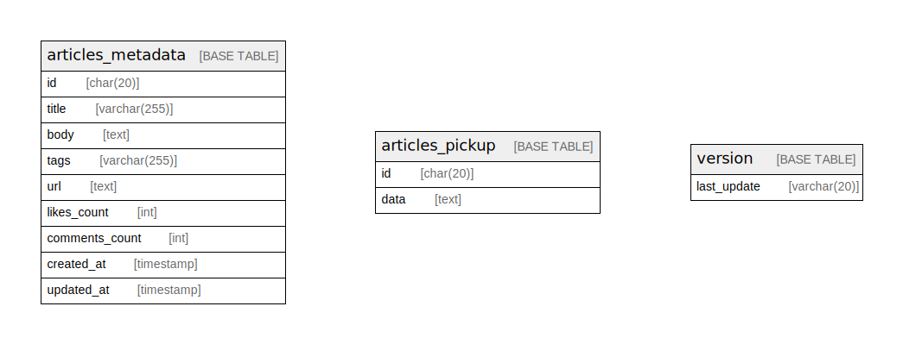

# database

## Tables

| Name | Columns | Comment | Type |
| ---- | ------- | ------- | ---- |
| [articles_metadata](articles_metadata.md) | 9 |  | BASE TABLE |
| [articles_pickup](articles_pickup.md) | 2 |  | BASE TABLE |
| [version](version.md) | 1 |  | BASE TABLE |

## Relations

---

> Generated by [tbls](https://github.com/k1LoW/tbls)
