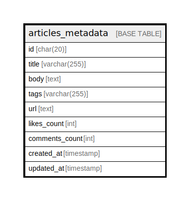

# articles_metadata

## Description

<details>
<summary><strong>Table Definition</strong></summary>

```sql
CREATE TABLE `articles_metadata` (
  `id` char(20) COLLATE utf8mb4_general_ci NOT NULL,
  `title` varchar(255) COLLATE utf8mb4_general_ci NOT NULL,
  `body` text COLLATE utf8mb4_general_ci NOT NULL,
  `tags` varchar(255) COLLATE utf8mb4_general_ci NOT NULL,
  `url` text COLLATE utf8mb4_general_ci NOT NULL,
  `likes_count` int NOT NULL,
  `comments_count` int NOT NULL,
  `created_at` timestamp NOT NULL,
  `updated_at` timestamp NOT NULL,
  PRIMARY KEY (`id`)
) ENGINE=InnoDB DEFAULT CHARSET=utf8mb4 COLLATE=utf8mb4_general_ci
```

</details>

## Columns

| Name | Type | Default | Nullable | Children | Parents | Comment |
| ---- | ---- | ------- | -------- | -------- | ------- | ------- |
| id | char(20) |  | false |  |  |  |
| title | varchar(255) |  | false |  |  |  |
| body | text |  | false |  |  |  |
| tags | varchar(255) |  | false |  |  |  |
| url | text |  | false |  |  |  |
| likes_count | int |  | false |  |  |  |
| comments_count | int |  | false |  |  |  |
| created_at | timestamp |  | false |  |  |  |
| updated_at | timestamp |  | false |  |  |  |

## Constraints

| Name | Type | Definition |
| ---- | ---- | ---------- |
| PRIMARY | PRIMARY KEY | PRIMARY KEY (id) |

## Indexes

| Name | Definition |
| ---- | ---------- |
| PRIMARY | PRIMARY KEY (id) USING BTREE |

## Relations



---

> Generated by [tbls](https://github.com/k1LoW/tbls)
