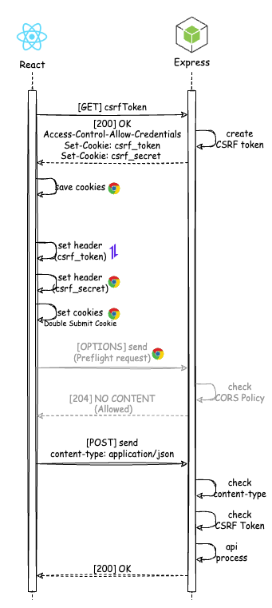

# Express.js モックサーバ

開発環境様にバックエンドとして動作する Express.js 製のモックサーバを構築している。

## 技術情報

### 技術スタック

| 種別             | 使用技術                                                                                    |
| ---------------- | ------------------------------------------------------------------------------------------- |
| 開発言語         | [TypeScript](https://www.typescriptlang.org/)                                               |
| フレームワーク   | [Express.js](https://expressjs.com/)                                                        |
| バリデーター     | [Yup](https://github.com/jquense/yup/)                                                      |
| ロガー           | [pino](https://github.com/pinojs/pino/)                                                     |
| エラーハンドラ   | [boom](https://github.com/hapijs/boom/)                                                     |
| セキュリティ対策 | [helmet](https://github.com/helmetjs/helmet/), [csurf](https://github.com/expressjs/csurf/) |
| OR マッパー      | [Prisma](https://www.prisma.io/)                                                            |
| データベース     | [MySQL](https://www.mysql.com/)                                                             |

## 開発情報

### コマンド

個別での実行も可能だが、基本は Makefile に記載の docker compose コマンドによって操作される想定である。  
Prisma は OR マッパーとしての用途に限定しており、マイグレーションは行わない。既存 DB からスキーマ定義をリバース生成し使用する。

|                            | コマンド          | 概要                                              |
| -------------------------- | ----------------- | ------------------------------------------------- |
| サービスのローカル起動     | `yarn dev`        | サービスをローカル環境で起動する                  |
| サービスの起動             | `yarn start`      | ビルド済みの資材を使いサービスを起動する          |
| 静的解析の実施             | `yarn lint`       | 静的解析を実施する                                |
| 単体テストの実施           | `yarn test:ut`    | UT を実施する                                     |
| ビルドの実施               | `yarn build`      | ソースファイルを JS にトランスパイルする          |
| スキーマ定義を生成         | `yarn gen:schema` | 実行中の DB からスキーマ定義ファイルを生成する    |
| Prisma Client コードを生成 | `yarn gen:client` | スキーマ定義に従い Prisma Client コードを生成する |

### セキュリティ

開発用のモックであるためセキュリティ対策の深堀りは不要だが、今回は自学も兼ねて実装している。  
サーバでは CSRF トークンによる検証が行われており、下記に処理の流れを図示する。

以上
